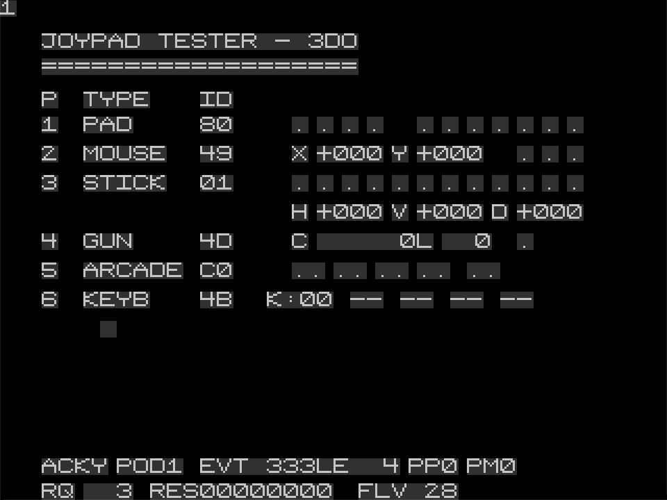

# Joypad Tester — 3DO

3DO build of the [Joypad Tester](../README.md). Talks directly to the
Portfolio event broker and renders the live state of every PBUS
device on the daisy chain.

## What it shows

<p align="center">
  
</p>

One row per detected pod:

| Class      | PBUS ID(s)  | Decoded fields                                |
|------------|-------------|-----------------------------------------------|
| `PAD`      | 0x80 / 0xA0 | D-pad, A/B/C, X, P (Start), L/R Shift         |
| `MOUSE`    | 0x49        | X / Y delta, L / M / R                        |
| `STICK`    | 0x01        | H / V / D analog, Fire/A/B/C/X/P/Shifts + hat |
| `GUN`      | 0x4D        | timing counter, line pulse, trigger           |
| `ARCADE`   | 0xC0        | P1/P2 Coin / Start, Service                   |
| `KEYB`     | 0x02 / 0x4B | 256-bit matrix + terminal-style typed text    |
| any other  | `0xNN`      | shown by raw class byte                       |

After 30 s of no input → bouncing-logo screensaver. Any input wakes.

## Build

Docker-only:

```
./build_docker.sh                # build
./build_docker.sh clean
./build_docker.sh rebuild-image
```

Compiles `main.cpp` against
[trapexit/3do-devkit](https://github.com/trapexit/3do-devkit), then
rebuilds the event broker daemon from
[trapexit/portfolio_os](https://github.com/trapexit/portfolio_os) with
every driverlet (pad, mouse, stick, lightgun, glasses, keyboard, plus
a local `SillyPadDriver.c` for 0xC0) static-linked in. Output:
`build/joypad-tester.iso`.

## Loading

- **CD-R** — burn the ISO, boot it. No modchip needed.
- **ODE** — drop the ISO on the SD.
- **Emulator** — RetroArch's Opera core / standalone Opera / Phoenix.
  Requires a 3DO BIOS in the emulator's `system/`.

## Credits

- Build infra: [trapexit/3do-devkit](https://github.com/trapexit/3do-devkit) (ISC).
- Driverlets: [trapexit/portfolio_os](https://github.com/trapexit/portfolio_os), with the keyboard one finished by us (PR open).
- `SillyPadDriver.c`: new, written from the PBUS spec + the
  [SNES23DO](https://github.com/SNES23DO/SNES23DO) firmware reference
  (Orbatak baked its 0xC0 driver into its game binary, no
  redistributable `CPORTC0.ROM` ever shipped).
